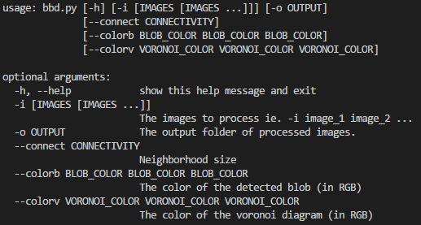
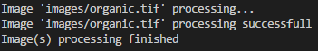

# Blue Blob Detection

Contents:

  * [Blue Blob Detection](#blue-blob-detection)
    * [Introduction](#introduction)
    * [Prerequisites](#prerequisites)
	* [Run it](#run-it)
    * [Matlab and Python integration](#matlab-and-python-integration)
      * [Prerequisites](#prerequisites)
      * [Code](#code)

## Introduction

This script aims to detect blue blobs which represent center of cells of an organic tissue.

Then a Voroinoi diagram is drawn over these detected blue blobs in order to represent the cells themselves.

Finally, we would like to simulate a blood flow in animating this diagram by giving a speed to the cells coming from a speed field.

**WARNING**

The detection is working only if the blobs are blue and nothing else. It cannot be use for a **General Blob Detection** !

## Prerequistes

For doing "Computer Vision", the script uses **OpenCV** library we choose to use for its efficiency:

[OpenCV For Linux](https://docs.opencv.org/trunk/d7/d9f/tutorial_linux_install.html)

[OpenCV For windows](https://docs.opencv.org/3.0-beta/doc/py_tutorials/py_setup/py_setup_in_windows/py_setup_in_windows.html)

## Run it

Please, check the script's options if you are interrested in specifying the parameters of the detection :

	python bbd.py -h

which should gives you :

You can try a first detection by using the image [organic.tif](images/organic.tif) :

	python bbd.py -i images/organic.tif
	
The processed image [images/organic_processed.tif]() should be generated and you should see the following stdout :

You can modify many parameters like the connectivity of the detection, the color of the voronoi diagram ...

## Matlab and Python integration

### Prerequistes

In order to be able to execute python script from matlab you have to :

[Install Matlab API for python](https://ch.mathworks.com/help/matlab/matlab_external/install-the-matlab-engine-for-python.html)

Add the git folder **Blue-Blob-Detection** containing bbd.py script to the PythonPath :

[Add a path to PythonPath in Windows](https://stackoverflow.com/questions/3701646/how-to-add-to-the-pythonpath-in-windows-7)

[Add a path to PythonPath in Linux](https://stackoverflow.com/questions/3402168/permanently-add-a-directory-to-pythonpath)

### Code

	python_return_value = py.bbd.main(**ABSOLUTE_PATH_OF_THE_IMAGE\images\organic.tif**);
	python_arrays = python_return_value{1};

	facets_number = size(python_arrays, 2);
	matlab_cell = cell(facets_number,1);

	for i = 1:facets_number
		temp_array = python_arrays{i};
		matlab_cell{i} = double(py.array.array('d',py.numpy.nditer(temp_array)));
	end
	
**Enjoy !**	